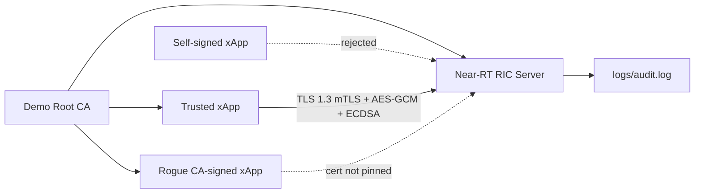

# O-RAN CTI Secure Communication Project

EC7201 Information Security group project aligned with the FYP topic: a Cyber Threat Intelligence (CTI) platform for Open RAN. The project implements a secure communication channel between a simulated Near-RT RIC and an untrusted xApp/CTI feed over the O-RAN E2 threat-telemetry path.

The implementation is intentionally small and demo-friendly: Node.js built-in `tls` and `crypto` modules, OpenSSL-generated PKI, no npm dependencies, and clear attack demos for the viva.

## What This Proves

| Security property | Implementation |
| --- | --- |
| Confidentiality | TLS 1.3 plus application-layer AES-256-GCM encryption for STIX CTI payloads |
| Integrity | AES-GCM authentication tag, HMAC-SHA256 protected header, canonical JSON verification |
| Authentication | Mutual certificate presentation, trusted CA validation, and RIC-side xApp certificate pinning |
| Non-repudiation | ECDSA P-256 signatures over payload, sender, timestamp, and nonce |
| Availability | Per-certificate rate limiting and bounded replay cache |
| Forward secrecy | TLS 1.3 ECDHE session keys; AES/HMAC keys are derived with TLS exporter labels |

## Architecture



## Project Structure

```text
src/
  ric-server.js          Near-RT RIC secure receiver
  xapp-client.js         xApp/CTI feed sender and attack modes
  demo-runner.js         Runs all live demo scenarios
  lib/                   Crypto, framing, replay, rate-limit, audit helpers
scripts/
  generate-pki.js        Generates CA, RIC, xApp, rogue, and signing keys
samples/
  stix-threat-indicator.json
docs/
  SECURITY_DESIGN.md
  DEMO_SCRIPT.md
  AWS_DEPLOYMENT.md
test/
  Node.js unit tests
```

Generated demo certificates and logs are written to `certs/` and `logs/`; both are ignored by git.

## Requirements

- Node.js 20 or newer
- OpenSSL 3.x

No package installation is required because the project uses Node built-ins only.

## Quick Start

```bash
node scripts/generate-pki.js
node --test
node src/demo-runner.js all
```

Equivalent npm scripts are also provided:

```bash
npm run pki
npm test
npm run demo:all
```

On Windows, the demo runner automatically uses a local named-pipe TLS transport. This avoids localhost TLS interception by antivirus products while still exercising TLS 1.3, client certificates, certificate pinning, AES-GCM, ECDSA, HMAC, replay checks, and rate limiting. On Linux/AWS, the RIC server uses normal TCP.

## Manual Run

Terminal 1:

```bash
node scripts/generate-pki.js
RIC_HOST=0.0.0.0 RIC_PORT=9443 node src/ric-server.js
```

Terminal 2:

```bash
node src/xapp-client.js --host 127.0.0.1 --port 9443 --profile xapp --mode normal
```

Attack modes:

```bash
node src/xapp-client.js --profile rogue --mode normal
node src/xapp-client.js --profile foreign --mode normal
node src/xapp-client.js --profile xapp --mode tamper
node src/xapp-client.js --profile xapp --mode replay
node src/xapp-client.js --profile xapp --mode flood --count 35
```

## Demo Outcomes

| Demo | Expected outcome |
| --- | --- |
| `legit` | RIC accepts STIX payload, verifies signature, logs accepted record |
| `rogue` | CA-signed but unpinned xApp is rejected |
| `foreign` | Self-signed xApp is rejected by CA validation |
| `tamper` | One flipped ciphertext byte causes AES-GCM authentication failure |
| `replay` | First message accepted, duplicate nonce rejected |
| `flood` | First messages accepted, excess messages rejected by rate limit |

Audit entries are appended as JSON lines in `logs/audit.log`.

## AWS Target

The provided VM IP is `54.242.77.97`. The generated RIC certificate includes this IP in its SAN by default. For deployment steps, see [docs/AWS_DEPLOYMENT.md](docs/AWS_DEPLOYMENT.md).

Short version on the VM:

```bash
node scripts/generate-pki.js
RIC_HOST=0.0.0.0 RIC_PORT=9443 node src/ric-server.js
```

From the xApp side:

```bash
node src/xapp-client.js --host 54.242.77.97 --port 9443 --profile xapp --mode normal
```

Restrict AWS Security Group inbound TCP `9443` to the demonstration/client IP, not the whole internet.

## Important Implementation Notes

- The original plan proposed Python. This implementation uses Node.js because the local environment has Node and OpenSSL available, while Python is not installed.
- TLS transport certificates are RSA-3072 for cross-platform TLS compatibility. CTI payload non-repudiation still uses ECDSA P-256 signatures as required by the security design.
- AES-256-GCM and HMAC-SHA256 keys are derived from the TLS 1.3 session using exporter labels. No symmetric key is hard-coded or transmitted.
- The RIC validates the client certificate against the demo CA, checks revocation config, and enforces certificate pinning before processing payloads.
- The client validates the RIC certificate against the demo CA and hostname/IP before sending payloads.

## References in This Repository

- Course brief: `Project Description.pdf`
- Initial plan: `oran_cti_security_plan (1).pdf`
- Detailed design: [docs/SECURITY_DESIGN.md](docs/SECURITY_DESIGN.md)
- Live demo guide: [docs/DEMO_SCRIPT.md](docs/DEMO_SCRIPT.md)
